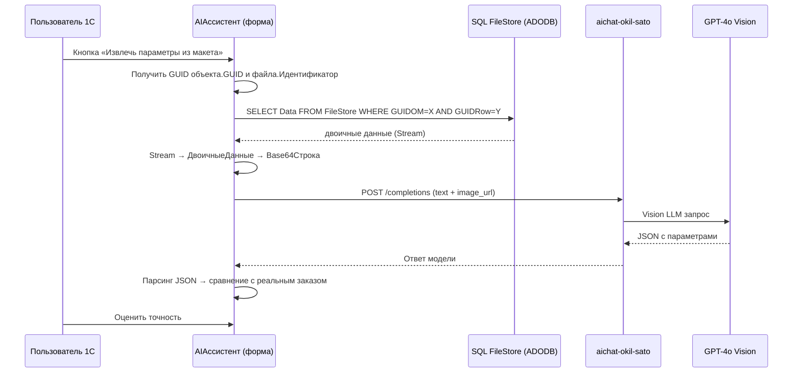

# PoC: Извлечение параметров оригинал-макета через Vision LLM (в 1С)

> **Цель:** проверить, способна ли Vision LLM (GPT-4o) извлечь параметры макета — размеры, цвета, тип этикетки, технологию — из файла макета (PDF/JPG). Всё делаем прямо в 1С.

**Статус:** Архитектура готова ✅ → ждём перехода в Code для реализации.

---

## 🗺️ Архитектура PoC



## 📦 Что уже есть

| Компонент | Готовность | Примечание |
|---|---|---|
| LLM-провайдер (`aichat-okil-sato`) | ✅ | OpenRouter-совместимый, `/api/v1/chat/completions` |
| `ОтправитьЗапросКLLM()` | ✅ | [`Module.bsl:19`](../1c/ERP/Обраб/AIАссистент/AIАссистент/Forms/Форма/Ext/Form/Module.bsl:19) |
| `Лико_ОригиналМакеты` с ТЧ `Файлы` | ✅ | Файлы лежат в SQL-таблице `FileStore`, доступ через ADODB |
| Получение файла из `FileStore` | ✅ | Код в `Лико_ОригиналМакеты.ФормаЭлемента.ПоказатьКартинка()` |
| ADODB-подключение через `Лико_ДополнительноКлиент.УстановитьСоединениеССервером()` | ✅ | Уже работает |
| `Base64Строка()` | ✅ | Встроенная функция платформы 1С |

## 🧩 Что нужно сделать (3 функции, ~200 строк BSL)

### 1. `ПолучитьДвоичныеДанныеФайлаМакета(СсылкаМакет, ИдентификаторФайла)` — серверная

Повторяет логику из `ПоказатьКартинку()`, но на сервере и возвращает `ДвоичныеДанные`.

```bsl
&НаСервере
Функция ПолучитьДвоичныеДанныеФайлаМакета(СсылкаМакет, ИдентификаторФайла)
    // 1. Получить ADODB-подключение (метод уже есть в Лико_ДополнительноКлиент)
    ПараметрыСоединения = Лико_ДополнительноКлиент.УстановитьСоединениеССервером();
    Подключение = ПараметрыСоединения.ADOConnection;
    Если Подключение = Неопределено Тогда
        Возврат Неопределено;
    КонецЕсли;

    // 2. Получить GUID объекта и GUID строки
    ИДСсылки = ЗначениеВСтрокуВнутр(СсылкаМакет);
    ИДСсылкиМакета = ЗначениеВСтрокуВнутр(ИдентификаторФайла);

    // 3. ADODB stream + recordset
    Stream = Новый COMОбъект("ADODB.Stream");
    Stream.Type = 1;  // binary
    Stream.Open();

    RecordSet = Новый COMОбъект("ADODB.RecordSet");
    RecordSet.CursorLocation = 3;
    RecordSet.LockType = 2;

    ЗапросSQL = "SELECT Data FROM FileStore WHERE GUIDOM = '" + ИДСсылки + "' AND GUIDRow = '" + ИДСсылкиМакета + "'";
    RecordSet.Open(ЗапросSQL, Подключение);

    Если RecordSet.RecordCount > 0 Тогда
        RecordSet.MoveFirst();
        Stream.Write(RecordSet.Fields("Data").Value);
        ИмяВременногоФайла = ПолучитьИмяВременногоФайла();
        Stream.SaveToFile(ИмяВременногоФайла);
        Stream.Close();
        RecordSet.Close();
        Результат = Новый ДвоичныеДанные(ИмяВременногоФайла);
        Лико_ДополнительноКлиент.ЗакрытьСоединениеССервером(ПараметрыСоединения);
        Возврат Результат;
    КонецЕсли;

    Stream.Close();
    RecordSet.Close();
    Лико_ДополнительноКлиент.ЗакрытьСоединениеССервером(ПараметрыСоединения);
    Возврат Неопределено;
КонецФункции
```

### 2. `ОтправитьИзображениеВVisionLLM(ДвоичныеДанные, Расширение, Промпт, Настройки)` — серверная

Модификация `ОтправитьЗапросКLLM()` — content формируем как массив `[{type:"text", text:...}, {type:"image_url", image_url:{url:"data:image/...;base64,..."}}]`.

**Ключевые отличия от существующей функции:**
- content: не строка, а массив с image_url
- добавлен `response_format: {type: "json_object"}`
- модель: `openai/gpt-4o-mini` (по умолчанию)

```bsl
&НаСервере
Функция ОтправитьИзображениеВVisionLLM(ДвоичныеДанные, Расширение, Промпт, НастройкиЗапроса = Неопределено)
    // ... настройки по умолчанию (URL, порт, ключ те же) ...
    МодельID = "openai/gpt-4o-mini";

    // Определяем MIME-тип
    Если Расширение = "pdf" Тогда
        MIME = "application/pdf";
    ИначеЕсли Расширение = "png" Тогда
        MIME = "image/png";
    ИначеЕсли Расширение = "jpg" ИЛИ Расширение = "jpeg" Тогда
        MIME = "image/jpeg";
    Иначе
        MIME = "image/jpeg";
    КонецЕсли;

    DataURL = "data:" + MIME + ";base64," + Base64Строка(ДвоичныеДанные);

    // Формируем content-массив
    Содержимое = Новый Массив;
    ТекстоваяЧасть = Новый Структура;
    ТекстоваяЧасть.Вставить("type", "text");
    ТекстоваяЧасть.Вставить("text", Промпт);
    Содержимое.Добавить(ТекстоваяЧасть);

    ИзображениеЧасть = Новый Структура;
    ИзображениеЧасть.Вставить("type", "image_url");
    ИзображениеURL = Новый Структура;
    ИзображениеURL.Вставить("url", DataURL);
    ИзображениеЧасть.Вставить("image_url", ИзображениеURL);
    Содержимое.Добавить(ИзображениеЧасть);

    Сообщения = Новый Массив;
    ПользовательскоеСообщение = Новый Структура;
    ПользовательскоеСообщение.Вставить("role", "user");
    ПользовательскоеСообщение.Вставить("content", Содержимое);
    Сообщения.Добавить(ПользовательскоеСообщение);

    ЗапросОбъект = Новый Структура;
    ЗапросОбъект.Вставить("model", МодельID);
    ЗапросОбъект.Вставить("messages", Сообщения);
    ЗапросОбъект.Вставить("temperature", 0.1);
    ЗапросОбъект.Вставить("max_tokens", 2000);

    РеспонсФормат = Новый Структура;
    РеспонсФормат.Вставить("type", "json_object");
    ЗапросОбъект.Вставить("response_format", РеспонсФормат);

    // ... HTTP-отправка, как в ОтправитьЗапросКLLM ...
    // Возврат структуры: {Успех, Ответ, ПолныйОтвет, ОписаниеОшибки, Стоимость}
КонецФункции
```

### 3. `ТестИзвлеченияПараметровМакета(ЗаказКлиента)` — обработчик кнопки

Добавляется в форму AIАссистента (или в форму ЗаказКлиента):

```bsl
&НаКлиенте
Процедура ИзвлечьПараметрыМакета(Команда)
    // Берём первый ОригиналМакет из ТЧ Товары текущего открытого заказа
    // Вызываем серверную функцию:
    //   - ПолучитьДвоичныеДанныеФайлаМакета(Макет, Идентификатор)
    //   - ПолучитьИмяРасширение(ИмяФайла, Имя, Расширение)
    //   - ОтправитьИзображениеВVisionLLM(ДвоичныеДанные, Расширение, Промпт)
    // Выводим JSON ответа рядом с реальными реквизитами заказа
    // Сохраняем результат для дальнейшего анализа
КонецПроцедуры
```

## 🤖 Промпт для Vision LLM

```
Ты — инженер-технолог типографии. Проанализируй изображение оригинал-макета этикетки
и верни ТОЛЬКО JSON (без markdown, без комментариев, без обрамляющих ```).

Извлеки:
1. label.width_mm — ширина этикетки в мм (число)
2. label.height_mm — высота этикетки в мм (число)
3. label.shape — "rectangle" / "rounded_rectangle" / "circle" / "oval"
4. colors.count — количество красок (число)
5. colors.list — массив строк: имена цветов или Pantone-коды ("PANTONE 485 C", "белый", "CMYK")
6. finishing.varnish — наличие лака: "glossy" / "matte" / null
7. finishing.foil — наличие фольги: "gold" / "silver" / null
8. content.has_barcode — наличие штрих-кода (boolean)
9. label_type — один из: "СамоклеящаясяЭтикетка" / "Термоусадка" / "Упаковка" / "Пакеты"
10. technology — "Флексо" / "Офсет" / "Цифра" / "Глубокая" / null
11. material_hint — предположительный материал: "плёнка PP" / "плёнка PE" / "бумага" / "термоусадка" / null
12. confidence — общая уверенность 0..1 (число)

JSON схема ответа строго:
{
  "label": {"width_mm": null, "height_mm": null, "shape": null},
  "colors": {"count": null, "list": []},
  "finishing": {"varnish": null, "foil": null},
  "content": {"has_barcode": null, "barcode_type": null},
  "label_type": null,
  "technology": null,
  "material_hint": null,
  "confidence": 0.0
}

ВСЕ неопределённые поля ставь null, не придумывай. Если видишь размерную рамку с цифрами —
это миллиметры (не дюймы, не пиксели). Pantone-коды ищи в формате "PANTONE XXX C/U" или "PMS XXX".
```

## 🎯 Модели и стратегия

Из результатов тестирования 15 моделей (см. [`chat-🛤️ Роутер и получение моделей.md`](../1c/ERP/Обраб/AIАссистент/chat-🛤️%20Роутер%20и%20получение%20моделей.md)):

| Модель | Цена/макет | OCR качество | Роль |
|---|---|---|---|
| `openai/gpt-4o-mini` | ~$0.001–0.002 | Хороший | **Основная** |
| `openai/gpt-4o` | ~$0.01–0.015 | Отличный (Pantone/мелкий текст) | **Fallback** |

**Каскад:** mini → если `confidence < 0.7` ИЛИ мало обязательных полей → gpt-4o.

## ⚠️ Нюанс с PDF

Код `ПоказатьКартинку()` преобразует JPG в PNG через `Новый Картинка().Преобразовать()`. PDF открывается через внешний http-просмотрщик, **не** через Vision LLM.

Для **PDF-макетов** в PoC нужно:
- **Вариант A:** преобразовать PDF в PNG на лету через Python (`pdf2image`) — микро-скрипт в `services/pdf_to_png.py`
- **Вариант B:** если провайдер API поддерживает PDF напрямую (Gemini поддерживает, GPT-4o — нет) — использовать Gemini
- **Рекомендация для PoC:** тестировать на JPG/PNG макетах в первую очередь. Для PDF — вариант A.

## 📊 План тестирования

| # | Метрика | Способ |
|---|---|---|
| 1 | Точность размеров | \|Ш_LLM − Ш_реальная\| ≤ 1 мм |
| 2 | Полнота цветов | recall: найдено / всего в ТЧ Цвета |
| 3 | Тип этикетки | совпадение `label_type` с `Лико_ТипЗаказа` |
| 4 | Технология | совпадение `technology` с реальной |
| 5 | JSON-валидность | % успешно распарсенных ответов |
| 6 | Цена за макет | `usage.cost` из ответа API |
| 7 | Время ответа | секунды |

## 🚦 Критерии успеха

| Порог | Действие |
|---|---|
| Размеры: ≥ 80% в допуске ±1мм | ✅ Идём в Этап 2 (индексация Qdrant) |
| Цвета: ≥ 70% recall | ✅ Идём в Этап 2 |
| JSON-валидность: 100% | ✅ Схема работает |
| Размеры: < 60% | ⚠️ Добавляем OCR-предпроход |
| Цвета: < 50% | ⚠️ Промпт-инжиниринг + OCR |

## 🗂️ Что дальше (после успешного PoC)

```
Этап 1 (PoC) ← МЫ ЗДЕСЬ
    ↓ успех
Этап 2: Индексация заказов-доноров в Qdrant
    - HTTP-сервис 1С для выгрузки заказов + макетов
    - Python indexer (bge-m3 эмбеддинг параметров)
    - Batch: все проведённые заказы за 2 года
    - Регламентное задание: инкремент новых
    ↓
Этап 3: Форма создания заказа из макета
    - Загрузка файла в 1С
    - Vision LLM → параметры
    - Qdrant поиск → top-K доноров
    - Копирование заказа + перезапись параметров
    - Форма подтверждения пользователем
```

---

*Документ сформирован 08.05.2026 на основе архитектурной сессии.*
*Способ получения файлов: ADODB → SQL FileStore (как в `Лико_ОригиналМакеты.ФормаЭлемента.ПоказатьКартинка()`).*
