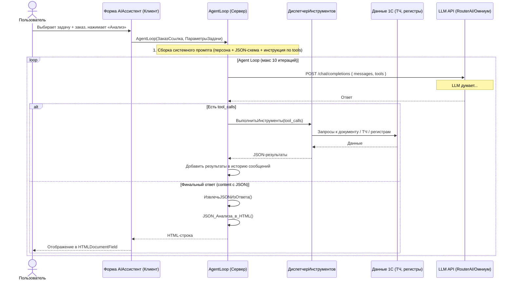

# Архитектура Agent Loop с инструментами (Function Calling)

**Дата:** 06.05.2026
**Контекст:** Обработка [`AIАссистент`](../1c/ERP/Обраб/AIАссистент/AIАссистент.xml)
**Версия:** 3.0 — всё внутри 1С

---

## 0. Ключевое решение: Фаза 1 (сейчас) vs Фаза 2 (потом)

| | Фаза 1 (MVP сейчас) | Фаза 2 (потом) |
|---|---|---|
| Где крутится Agent Loop | Модуль формы AIАссистент | HTTP-сервис 1С |
| Кто вызывает | Кнопка в форме | HTTP-запрос извне |
| Протокол | Внутренний вызов функций | HTTP REST |
| Сессия | В рамках открытой формы | По токену/сессии |

**Сейчас проектируем Фазу 1** с учётом, что код будет легко вынесен в HTTP-сервис.

---

## 1. Ключевая идея: Задачи ⟂ Инструменты

Три слоя, **два из них ортогональны (независимы):**

| Слой | Что определяет | Меняется ли? |
|------|----------------|--------------|
| 🔧 **Инструменты** | Какие данные ДОСТУПНЫ для получения из 1С | ❌ НЕТ — единый реестр для всех задач |
| 🎯 **Задачи** | КАК интерпретировать данные + КАКОЙ JSON вернуть | ✅ ДА — каждая задача = свой промпт + своя схема ответа |
| 📝 **Промпт** | Персона + инструкция + JSON-схема = собирается из задачи | ✅ ДА — формируется динамически |

**LLM сама решает**, какие инструменты ей нужны:
- **Технолог** вызовет: `get_order_header`, `get_label_params`, `get_colors`, `get_production_params`, `get_quality`
- **Экономист** вызовет: `get_order_header`, `get_costs`, `get_economics`, `get_production_params`
- **Обучение** вызовет: `get_order_header`, `get_label_params`, `get_colors`, `get_production_flags`, `get_metrics`

---

## 2. Схема взаимодействия (Фаза 1 — всё в 1С)



---

## 3. Реестр задач (центральная конфигурация)

```bsl
Функция ЗадачиАнализа()
    Задачи = Новый Соответствие;

    // ── Технолог ──
    Задача = Новый Структура;
    Задача.Вставить("Код", "technologist");
    Задача.Вставить("Название", "Технологический анализ");
    Задача.Вставить("Иконка", "⚙️");
    Задача.Вставить("Персона", 
        "Ты — опытный технолог типографии Лико, специализирующийся на производстве
        |самоклеящихся этикеток, термоусадки и упаковки для FMCG.
        |Твоя задача — проанализировать заказ и выявить технологические риски.");
    Задача.Вставить("СхемаОтвета", СхемаОтвета_Технолог());
    Задачи.Вставить("technologist", Задача);

    // ── Экономист ──
    Задача = Новый Структура;
    Задача.Вставить("Код", "economist");
    Задача.Вставить("Название", "Экономический анализ");
    Задача.Вставить("Иконка", "💰");
    Задача.Вставить("Персона",
        "Ты — финансовый аналитик типографии Лико. 
        |Твоя задача — проанализировать рентабельность заказа и структуру затрат.");
    Задача.Вставить("СхемаОтвета", СхемаОтвета_Экономист());
    Задачи.Вставить("economist", Задача);

    // ── Полный ──
    Задача = Новый Структура;
    Задача.Вставить("Код", "full");
    Задача.Вставить("Название", "Комплексный анализ");
    Задача.Вставить("Иконка", "📊");
    Задача.Вставить("Персона",
        "Ты — главный технолог и финансовый директор типографии Лико.
        |Проведи комплексный анализ: технология + экономика + ресурсы.");
    Задача.Вставить("СхемаОтвета", СхемаОтвета_Полный());
    Задачи.Вставить("full", Задача);

    // ── Обучение ──
    Задача = Новый Структура;
    Задача.Вставить("Код", "educational");
    Задача.Вставить("Название", "Объяснение заказа (для не-технологов)");
    Задача.Вставить("Иконка", "🎓");
    Задача.Вставить("Персона",
        "Ты — преподаватель полиграфии. Объясни этот заказ простым языком человеку
        |БЕЗ технического образования (менеджеру, бухгалтеру, новичку).
        |Расскажи: что за продукт, как его будут делать по шагам,
        |что означают термины (раппорт, ручьи, грамматура, пантон и т.д.).
        |Избегай жаргона, объясняй ВСЕ термины.");
    Задача.Вставить("СхемаОтвета", СхемаОтвета_Обучение());
    Задачи.Вставить("educational", Задача);

    Возврат Задачи;
КонецФункции
```

---

## 4. Реестр инструментов (единый для всех задач)

| # | Имя | Описание | Данные из |
|---|-----|----------|-----------|
| 1 | `get_order_header` | Шапка: номер, дата, клиент, менеджер, статус, тип, вид, состояние, РЦ | ДокументОбъект |
| 2 | `get_label_params` | Этикетка: ширина, высота, раппорт, ручьи, шаг, длина печати, тираж | ДокументОбъект |
| 3 | `get_production_flags` | Флаги: цифра, ламинация, тиснение, трафарет, конгрев, нумератор | ДокументОбъект |
| 4 | `get_colors` | ТЧ Цвета: краски, тип, грамматура, % заливки, пантоны, секции | ТЧ Цвета |
| 5 | `get_costs` | Затраты: статья, РЦ, количество, сумма, метраж, расход краски | Регистр Лико_Затраты |
| 6 | `get_production_params` | Параметры: скорости, времена, метраж, стоимость, рентабельность | Регистр Лико_ПараметрыПроизводстваЗаказа |
| 7 | `get_metrics` | Метрики: тираж, метраж, время, нормо-часы, клики, ролики, коробки | ДокументОбъект |
| 8 | `get_economics` | Экономика: сумма, валюта, себестоимость, рентабельность, доход, оснастка | ДокументОбъект |
| 9 | `get_quality` | Качество: орфография, ШК, ОТК, дизайнер, образец цвета, читабельность | ДокументОбъект |

### Формат описания инструмента (OpenAI Tools API)

```bsl
Функция ОписаниеИнструментов()
    Инструменты = Новый Массив;

    // Пример одного инструмента
    Инструмент = Новый Структура;
    Инструмент.Вставить("type", "function");

    ФункцияИнстр = Новый Структура;
    ФункцияИнстр.Вставить("name", "get_order_header");
    ФункцияИнстр.Вставить("description",
        "Получить данные шапки заказа: номер, дата, клиент, менеджер, статус,
        |тип заказа, вид заказа, состояние, рабочий центр");

    Параметры = Новый Структура;
    Параметры.Вставить("type", "object");
    Параметры.Вставить("properties", Новый Структура);
    Параметры.Вставить("required", Новый Массив);

    ФункцияИнстр.Вставить("parameters", Параметры);
    Инструмент.Вставить("function", ФункцияИнстр);
    Инструменты.Добавить(Инструмент);

    // ... ещё 8 инструментов

    Возврат Инструменты;
КонецФункции
```

---

## 5. Agent Loop — основной алгоритм

```bsl
//+Лико m.shenderov 06.05.2026
// Основной цикл взаимодействия с LLM через function calling
&НаСервере
Функция AgentLoop(ДокументСсылка, КодЗадачи = "full")
    // 1. Получаем параметры задачи
    ВсеЗадачи = ЗадачиАнализа();
    Если НЕ ВсеЗадачи.Получить(КодЗадачи, ПараметрыЗадачи) Тогда
        Возврат ПолучитьОшибкуHTML("Неизвестная задача: " + КодЗадачи);
    КонецЕсли;

    // 2. Сборка системного промпта
    СистемныйПромпт = СобратьСистемныйПромпт(ПараметрыЗадачи, ДокументСсылка);

    // 3. Инициализация истории сообщений
    История = Новый Массив;
    История.Добавить(Сообщение("system", СистемныйПромпт));
    История.Добавить(Сообщение("user",
        "Проанализируй заказ. Используй инструменты для получения нужных данных.
        |Когда данных достаточно — верни ИТОГОВЫЙ JSON-анализ."));

    // 4. Получаем описание инструментов
    Инструменты = ОписаниеИнструментов();

    // 5. Agent Loop
    МаксИтераций = 10;

    Для Итерация = 1 По МаксИтераций Цикл
        РезультатLLM = ОтправитьЗапросКLLM_сИнструментами(История, Инструменты,
            ПараметрыЗадачи.ПараметрыПровайдера);

        Если НЕ РезультатLLM.Успех Тогда
            Возврат ПолучитьОшибкуHTML("Ошибка LLM (итерация " + Итерация + "): "
                + РезультатLLM.ОписаниеОшибки);
        КонецЕсли;

        СообщениеLLM = РезультатLLM.Сообщение;

        // Проверяем: tool_calls или финальный ответ?
        Если СообщениеLLM.Свойство("tool_calls")
           И ТипЗнч(СообщениеLLM.tool_calls) = Тип("Массив")
           И СообщениеLLM.tool_calls.Количество() > 0 Тогда

            // Добавляем ответ ассистента с tool_calls в историю
            История.Добавить(СообщениеLLM);

            // Выполняем инструменты и добавляем результаты
            РезультатыИнструментов = ВыполнитьИнструменты(СообщениеLLM.tool_calls);
            Для Каждого Рез Из РезультатыИнструментов Цикл
                История.Добавить(Рез);
            КонецЦикла;

        ИначеЕсли СообщениеLLM.Свойство("content")
                 И ЗначениеЗаполнено(СообщениеLLM.content) Тогда

            // Финальный ответ — парсим JSON и рендерим HTML
            Возврат ОбработатьФинальныйОтвет(СообщениеLLM.content, КодЗадачи);

        Иначе
            Возврат ПолучитьОшибкуHTML(
                "Неожиданный формат ответа от LLM на итерации " + Итерация);
        КонецЕсли;

    КонецЦикла;

    Возврат ПолучитьОшибкуHTML(
        "Превышено максимальное количество итераций Agent Loop (" + МаксИтераций + ")");
КонецФункции
```

---

## 6. Стратегия извлечения JSON (защита от «сломанных» моделей)

**Проблема:** через RouterAI разные модели. Не все понимают `json_object`. Некоторые оборачивают в ```` ```json ````, добавляют пояснения.

**Решение из [`ОтчетСравнениеAi.md`](../1c/ERP/Обраб/AIАссистент/ОтчетСравнениеAi.md:385-423):**

| Уровень | Механизм | Гарантия |
|--------|----------|----------|
| API | `response_format: { type: "json_object" }` | 80% моделей |
| Prompt | «ТОЛЬКО JSON, без ```json, без пояснений» | 95% |
| 1С Parser | `ИзвлечьJSONИзОтвета()` — 3 попытки | 99% |
| Last resort | Показать сырой текст в HTML | 100% |

```bsl
//+Лико m.shenderov 06.05.2026
Функция ИзвлечьJSONИзОтвета(СыройОтвет)
    // Попытка 1: прямой парсинг
    Попытка
        ЧтениеJSON = Новый ЧтениеJSON;
        ЧтениеJSON.УстановитьСтроку(СыройОтвет);
        Результат = ПрочитатьJSON(ЧтениеJSON);
        ЧтениеJSON.Закрыть();
        Возврат Результат;
    Исключение КонецПопытки;

    // Попытка 2: убираем ```json ... ```
    Очищенный = СтрЗаменить(СыройОтвет, "```json", "");
    Очищенный = СтрЗаменить(Очищенный, "```", "");
    Очищенный = СокрЛП(Очищенный);

    Попытка
        ЧтениеJSON = Новый ЧтениеJSON;
        ЧтениеJSON.УстановитьСтроку(Очищенный);
        Результат = ПрочитатьJSON(ЧтениеJSON);
        ЧтениеJSON.Закрыть();
        Возврат Результат;
    Исключение КонецПопытки;

    // Попытка 3: ищем первую { и последнюю }
    Поз1 = СтрНайти(Очищенный, "{");
    Поз2 = СтрНайти(Очищенный, "}", НаправлениеПоиска.СКонца);
    Если Поз1 > 0 И Поз2 > Поз1 Тогда
        Фрагмент = Сред(Очищенный, Поз1, Поз2 - Поз1 + 1);
        Попытка
            ЧтениеJSON = Новый ЧтениеJSON;
            ЧтениеJSON.УстановитьСтроку(Фрагмент);
            Результат = ПрочитатьJSON(ЧтениеJSON);
            ЧтениеJSON.Закрыть();
            Возврат Результат;
        Исключение КонецПопытки;
    КонецЕсли;

    Возврат Неопределено;
КонецФункции
```

---

## 7. JSON-схемы ответов для каждой задачи

### 7.1 Технолог / Экономист / Полный

Из [`ОтчетСравнениеAi.md`](../1c/ERP/Обраб/AIАссистент/ОтчетСравнениеAi.md:200-379) — оптимальная структура. Для каждой задачи часть полей опциональна:

| Поле | Технолог | Экономист | Полный |
|------|:--:|:--:|:--:|
| `verdict` | ✅ | ✅ | ✅ |
| `risks` | ✅ | | ✅ |
| `technology` | ✅ | | ✅ |
| `timeline` | ✅ | | ✅ |
| `economics` | | ✅ | ✅ |
| `resources` | | | ✅ |
| `quality_checkpoints` | ✅ | | ✅ |
| `meta` | ✅ | ✅ | ✅ |

### 7.2 Обучение (educational)

```json
{
  "order_overview": {
    "product_name": "...",
    "size_friendly": "72.5 × 180 мм — примерно как две банковские карты в высоту",
    "quantity_friendly": "100 000 штук",
    "client": "..."
  },
  "process_steps": [
    {
      "step": 1,
      "name": "Допечатная подготовка",
      "description_simple": "...",
      "why_important": "...",
      "real_data_note": "В заказе: ..."
    }
  ],
  "technology_explained": {
    "method": "Флексография",
    "what_is_it": "Это печать резиновыми формами — как большой штамп...",
    "why_this_method": "...",
    "machine": "Nilpeter FA 4 — датская машина, 10 секций"
  },
  "colors_and_sections": [
    { "section": 2, "color": "Cyan", "purpose": "...", "interesting": "Расход: 2.3 г/м²" }
  ],
  "glossary": [
    { "term": "Раппорт", "meaning": "Длина одного повторяющегося рисунка вдоль полотна" }
  ],
  "fun_facts": [
    "17 211 метров материала — это 17 км"
  ],
  "meta": { "analysis_type": "educational", "generated_at": "..." }
}
```

---

## 8. JSON → HTML рендеринг

Вместо того чтобы LLM генерировала HTML (трата токенов), она возвращает JSON, а 1С рендерит HTML по шаблонам:

```bsl
Функция JSON_Анализа_в_HTML(ДанныеJSON, КодЗадачи)
    Если КодЗадачи = "educational" Тогда
        Возврат JSON_Обучения_в_HTML(ДанныеJSON);
    КонецЕсли;

    // Общий рендерер для technologist / economist / full
    HTML = Новый Массив;
    HTML.Добавить(СтилиHTML());

    Если ДанныеJSON.Свойство("verdict") Тогда
        HTML.Добавить(СекцияВердикта(ДанныеJSON.verdict));
    КонецЕсли;
    Если ДанныеJSON.Свойство("risks") Тогда
        HTML.Добавить(СекцияРисков(ДанныеJSON.risks));
    КонецЕсли;
    Если ДанныеJSON.Свойство("technology") Тогда
        HTML.Добавить(СекцияТехнологии(ДанныеJSON.technology));
    КонецЕсли;
    Если ДанныеJSON.Свойство("timeline") Тогда
        HTML.Добавить(СекцияТаймлайна(ДанныеJSON.timeline));
    КонецЕсли;
    Если ДанныеJSON.Свойство("economics") Тогда
        HTML.Добавить(СекцияЭкономики(ДанныеJSON.economics));
    КонецЕсли;
    Если ДанныеJSON.Свойство("resources") Тогда
        HTML.Добавить(СекцияРесурсов(ДанныеJSON.resources));
    КонецЕсли;
    Если ДанныеJSON.Свойство("quality_checkpoints") Тогда
        HTML.Добавить(СекцияКачества(ДанныеJSON.quality_checkpoints));
    КонецЕсли;

    Возврат СтрСоединить(HTML, "");
КонецФункции
```

---

## 9. План реализации (5 этапов)

### Этап 1: Рефакторинг функций сбора данных
- [ ] Каждая из 9 функций — отдельный метод, возврат JSON-строки
- [ ] `ОчиститьСтруктуруДляJSON()` — проверить на всех типах
- [ ] Протестировать каждую через MCP: [`execute_bsl`](../1c/ERP/Обраб/AIАссистент/AIАссистент/Forms/Форма/Ext/Form/Module.bsl)

### Этап 2: Диспетчер инструментов
- [ ] `ОписаниеИнструментов()` — массив из 9 описаний OpenAI tools
- [ ] `ВыполнитьИнструменты(МассивToolCalls)` — диспетчер по имени
- [ ] 9 функций `ВыполнитьИнструмент_get_*()` — обёртки

### Этап 3: Agent Loop
- [ ] `ЗадачиАнализа()` — реестр 4 задач
- [ ] `СхемаОтвета_*()` — для каждой задачи
- [ ] `СобратьСистемныйПромпт()` — persona + JSON-схема + инструкция по tools
- [ ] `ОтправитьЗапросКLLM_сИнструментами()` — `tools` + `response_format: json_object`
- [ ] `AgentLoop()` — основной цикл
- [ ] `ИзвлечьJSONИзОтвета()` — fallback-парсер

### Этап 4: JSON → HTML
- [ ] `ОбработатьФинальныйОтвет()` — парсинг + рендеринг
- [ ] `JSON_Анализа_в_HTML()` — универсальный рендерер
- [ ] `СекцияВердикта()`, `СекцияРисков()`, ... — шаблоны
- [ ] `JSON_Обучения_в_HTML()` — рендерер для educational

### Этап 5: Интеграция и тестирование
- [ ] Заменить `ОтправитьЗапросАнализаЗаказа()` → `AgentLoop()`
- [ ] Добавить выбор задачи в UI
- [ ] Протестировать все 4 задачи через MCP
- [ ] Сравнить стоимость токенов (было vs стало)

---

## 10. Ожидаемый эффект

| Показатель | Было (монолитный промпт) | Стало (Agent Loop) |
|-----------|--------------------------|-------------------|
| Токены на вход (типичный) | ~3200 | ~500 + ~1200 (данные по запросу) |
| Токены на вход (все данные) | ~3200 | ~1500-2000 (только нужное) |
| Гибкость | 3 жёстких типа | 4+ задач, легко добавить |
| Расширяемость | Растёт промпт | Инструмент или задача |
| Ответ | HTML/Markdown | JSON → шаблон → HTML |
| Стоимость | ~$0.16 | ~$0.05-0.10 |
| Обучение | Нет | Задача educational |
| Готовность к Фазе 2 | Нет | Код легко вынести в HTTP-сервис |
