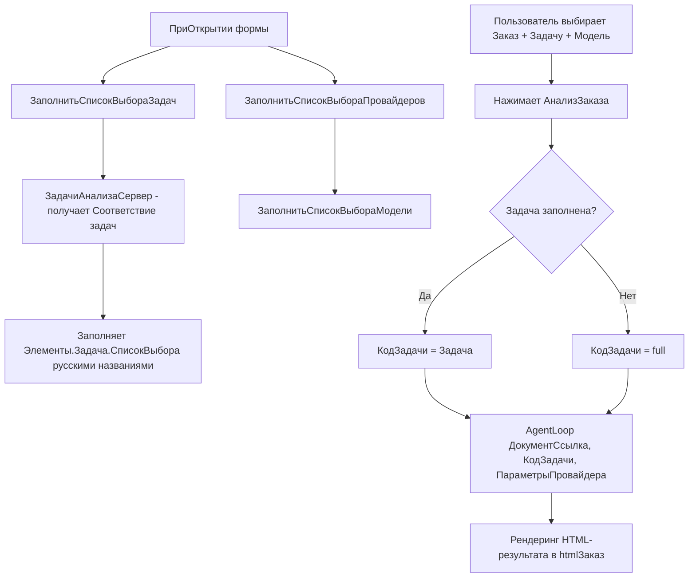

# План: Добавление выбора задачи на форму AI Ассистента

## Цель
Добавить выпадающий список «Задача» (аналогично существующим «Провайдер» и «Модель») на форму обработки [`AIАссистент`](1c/ERP/Обраб/AIАссистент/AIАссистент/Forms/Форма/Ext/Form.xml), чтобы пользователь мог выбрать тип анализа (Технолог, Экономист, Полный, Обучение) **на русском языке** перед запуском.

## Контекст
- Задачи уже определены в серверной функции [`ЗадачиАнализа()`](1c/ERP/Обраб/AIАссистент/AIАссистент/Forms/Форма/Ext/Form/Module.bsl:1421) с полями: `Код`, `Название` (русское), `Иконка`, `Персона`.
- Сейчас [`АнализЗаказа`](1c/ERP/Обраб/AIАссистент/AIАссистент/Forms/Форма/Ext/Form/Module.bsl:271) всегда запускает `AgentLoop` с типом по умолчанию (`"full"`) — без возможности выбора.
- Паттерн заполнения выпадающих списков уже реализован: [`ЗаполнитьСписокВыбораПровайдеров()`](1c/ERP/Обраб/AIАссистент/AIАссистент/Forms/Форма/Ext/Form/Module.bsl:233) и [`ЗаполнитьСписокВыбораМодели()`](1c/ERP/Обраб/AIАссистент/AIАссистент/Forms/Форма/Ext/Form/Module.bsl:212).

## Изменения

### 1. Form.xml — добавить атрибут `Задача` и `InputField`

**Файл:** [`Form.xml`](1c/ERP/Обраб/AIАссистент/AIАссистент/Forms/Форма/Ext/Form.xml)

В секцию `<Attributes>` добавить новый атрибут:

```xml
<Attribute name="Задача" id="9">
    <Title>
        <v8:item>
            <v8:lang>ru</v8:lang>
            <v8:content>Задача</v8:content>
        </v8:item>
    </Title>
    <Type>
        <v8:Type>xs:string</v8:Type>
        <v8:StringQualifiers>
            <v8:Length>0</v8:Length>
            <v8:AllowedLength>Variable</v8:AllowedLength>
        </v8:StringQualifiers>
    </Type>
</Attribute>
```

В секцию `<ChildItems>`, в группу `ГруппаМодель` (рядом с Моделью) добавить `InputField`:

```xml
<InputField name="Задача" id="36">
    <DataPath>Задача</DataPath>
    <GroupVerticalAlign>Center</GroupVerticalAlign>
    <ListChoiceMode>true</ListChoiceMode>
    <ExtendedEditMultipleValues>true</ExtendedEditMultipleValues>
    <ContextMenu name="ЗадачаКонтекстноеМеню" id="37"/>
    <ExtendedTooltip name="ЗадачаРасширеннаяПодсказка" id="38"/>
</InputField>
```

### 2. Module.bsl — добавить процедуру заполнения списка задач

**Файл:** [`Module.bsl`](1c/ERP/Обраб/AIАссистент/AIАссистент/Forms/Форма/Ext/Form/Module.bsl)

Добавить клиентскую процедуру (по аналогии с `ЗаполнитьСписокВыбораПровайдеров`):

```bsl
&НаКлиенте
Процедура ЗаполнитьСписокВыбораЗадач() Экспорт
    Элементы.Задача.СписокВыбора.Очистить();
    
    // Задачи получаем с сервера, т.к. ЗадачиАнализа() — серверная
    Задачи = ЗадачиАнализаСервер();
    
    Для Каждого ПараметрыЗадачи Из Задачи Цикл
        Элементы.Задача.СписокВыбора.Добавить(
            ПараметрыЗадачи.Ключ,
            ПараметрыЗадачи.Значение.Иконка + " " + ПараметрыЗадачи.Значение.Название
        );
    КонецЦикла;
КонецПроцедуры
```

Добавить серверную функцию-обёртку:

```bsl
&НаСервере
Функция ЗадачиАнализаСервер()
    Возврат ЗадачиАнализа();
КонецФункции
```

### 3. Module.bsl — вызвать заполнение в `ПриОткрытии`

В существующей процедуре [`ПриОткрытии`](1c/ERP/Обраб/AIАссистент/AIАссистент/Forms/Форма/Ext/Form/Module.bsl:256) добавить вызов:

```bsl
ЗаполнитьСписокВыбораЗадач();
```

А также установить значение по умолчанию (опционально):

```bsl
Если НЕ ЗначениеЗаполнено(Задача) Тогда
    Задача = "full";
КонецЕсли;
```

### 4. Module.bsl — обновить `АнализЗаказа`

В процедуре [`АнализЗаказа`](1c/ERP/Обраб/AIАссистент/AIАссистент/Forms/Форма/Ext/Form/Module.bsl:271) заменить:

```bsl
// Было:
РезультатHTML = ОтправитьЗапросАнализаЗаказа(Заказ, , Провайдер, Модель);

// Стало:
КодЗадачи = ?(ЗначениеЗаполнено(Задача), Задача, "full");
РезультатHTML = ОтправитьЗапросАнализаЗаказа(Заказ, КодЗадачи, Провайдер, Модель);
```

### 5. Module.bsl — добавить обработчик `ЗадачаПриИзменении` (опционально)

Можно оставить пустым или показывать описание задачи:

```bsl
&НаКлиенте
Процедура ЗадачаПриИзменении(Элемент)
    // Можно добавить логику при смене задачи (например, показать подсказку)
КонецПроцедуры
```

## Блок-схема потока



## Порядок выполнения (файлы)

1. `1c/ERP/Обраб/AIАссистент/AIАссистент/Forms/Форма/Ext/Form.xml` — добавить атрибут + InputField
2. `1c/ERP/Обраб/AIАссистент/AIАссистент/Forms/Форма/Ext/Form/Module.bsl` — добавить `ЗаполнитьСписокВыбораЗадач()`, `ЗадачиАнализаСервер()`, обновить `ПриОткрытии` и `АнализЗаказа`
