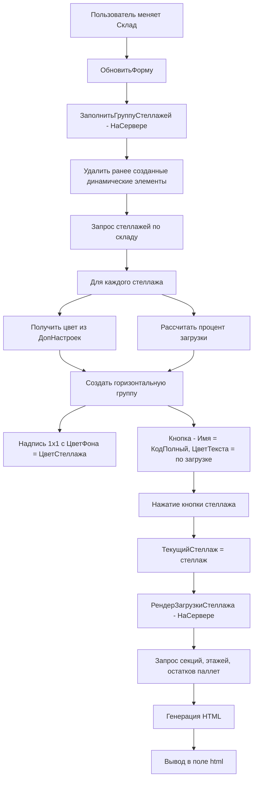

# План: Визуализация заполняемости склада

## Контекст

Обработка `ЗагрузкаСклада` (`1c/ERP/Обраб/ЗагузкаСклада/`) должна графически отображать заполняемость склада.  
Форма содержит: реквизит `Склад`, реквизит `html` (HTMLДокумент), реквизит `ТекущийСтеллаж`, группу `ГруппаСтеллажи`, команду `ОбновитьФорму`.

## Структура данных

### Справочник Лико_Стеллажи
- Реквизиты: `КодПолный`, `Наименование`, `Склад`, `КоличествоСекций`, `КоличествоЯчеекВСекции`, `КоличествоЗонПриемкиОтгрузки`, `ВремяДоступа`, `ДопНастройки` (ХранилищеЗначения - структура с `ЦветСтеллажа`)
- ТЧ `Этажи`: Типоразмер (ссылка на Лико_ТипоразмерыСкладскихСекций с реквизитами Вес, Ширина, Высота, Глубина, Объем)
- ТЧ `ЗоныПриемкиОтгрузки`: АдресХранения

### Справочник Лико_СкладскиеСекции
- Реквизиты: `Стеллаж`, `Ряд`, `Место`, `Этаж` (номер этажа), `Адрес1`, `Адрес2`, `Адрес3`, `КоличествоАдресов`, `Типоразмер`, `ВремяДоступа`

### РегистрНакопления Лико_ПаллетыВСекциях
- Измерения: `Секция`, `Паллет`, `Адрес`
- Ресурсы: `Количество`, `Заблокирован`

### Правила размещения паллет в секции (3 ячейки)

Секция всегда содержит 3 адреса (Адрес1, Адрес2, Адрес3). Правила:
1. Если ширина паллета > 1/2 ширины секции → **1 паллет**, только в средний адрес (Адрес2)
2. Если ширина паллета > 1/3 ширины секции → **2 паллета**, в крайние адреса (Адрес1, Адрес3)
3. Если ширина паллета ≤ 1/3 ширины секции → **3 паллета**, во все адреса

### Приоритеты подбора ячейки
1. Наличие свободного места (паллет1, паллет2, паллет3)
2. Остаток высоты (ОстатокВысота)
3. Остаток ширины (ОстатокШирина)
4. Остаток веса (ОстатокВес)
5. Время доступа (ВремяДоступа)

## Архитектура решения



## Детальный план реализации

### Шаг 1: Модификация XML формы (Ext/Form.xml)

Добавить реквизиты:
- `ДинамическиеЭлементы` — тип `СписокЗначений` (имена созданных динамических элементов для удаления при обновлении)
- `СтеллажиСоответствие` — тип `Соответствие` (КодПолный -> ссылка на стеллаж)

Добавить команду:
- `ВыбратьСтеллаж` — обработчик `ВыбратьСтеллаж` на клиенте

### Шаг 2: Процедура ЗаполнитьГруппуСтеллажей (НаСервере)

```
Процедура ЗаполнитьГруппуСтеллажей()
  1. Удалить ранее созданные динамические элементы (из ДинамическиеЭлементы)
  2. Запрос: выбрать стеллажи где Склад = Объект.Склад И НЕ ПометкаУдаления
  3. Для каждого стеллажа:
     a. Получить ДопНастройки -> ЦветСтеллажа
     b. Рассчитать % загрузки (занятые ячейки / общее кол-во адресов)
     c. Создать ГруппаФормы (горизонтальная) в ГруппаСтеллажи
     d. Создать ДекорацияФормы (Надпись): ширина 1, высота 1, авто-размер = нет,
        ЦветФона = ЦветСтеллажа
     e. Создать КнопкаФормы: ИмяКоманды = ВыбратьСтеллаж,
        Заголовок = Наименование стеллажа,
        ЦветТекста = ЦветЗагрузки(процент)
     f. Запомнить имена элементов в ДинамическиеЭлементы
     g. Запомнить соответствие КодПолный -> ссылка в СтеллажиСоответствие
КонецПроцедуры
```

### Шаг 3: Обработчик ВыбратьСтеллаж (НаКлиенте)

```
Процедура ВыбратьСтеллаж(Команда)
  // Команда.Имя содержит КодПолный стеллажа
  // Ищем стеллаж по соответствию
  ТекущийСтеллаж = СтеллажиСоответствие[Команда.Имя];
  // Вызываем серверный рендер
  html = РендерЗагрузкиСтеллажа(ТекущийСтеллаж);
  // html обновляется автоматически через привязку DataPath
КонецПроцедуры
```

### Шаг 4: Функция ЦветЗагрузкиПроцент (НаСервере)

```
Процент загрузки -> Цвет текста кнопки:
  < 50%  -> Зеленый
  51-89% -> Синий
  91-99% -> Оранжевый
  100%   -> Красный
```

### Шаг 5: Функция ЦветСтеллажаИзДопНастроек (НаСервере)

```
ДопНастройки = СтеллажСсылка.ДопНастройки.Получить();
Если ТипЗнч(ДопНастройки) = Тип("Структура") Тогда
    ДопНастройки.Свойство("ЦветСтеллажа", ЦветСтеллажа);
    Возврат ЦветСтеллажа;
КонецЕсли;
Возврат WebЦвета.Серый;
```

### Шаг 6: Функция ПолучитьПроцентЗагрузкиСтеллажа (НаСервере)

```
Алгоритм:
  1. Запрос всех секций стеллажа -> сумма КоличествоАдресов = ВсегоЯчеек
  2. Запрос остатков Лико_ПаллетыВСекциях по секциям стеллажа
     -> количество уникальных Адресов с Количество > 0 = ЗанятоЯчеек
  3. Процент = ЗанятоЯчеек / ВсегоЯчеек * 100
```

### Шаг 7: Процедура РендерЗагрузкиСтеллажа (НаСервере) — ГЛАВНАЯ

```
Процедура РендерЗагрузкиСтеллажа(Стеллаж, html)

  // 1. Получить данные:
  //    - Этажи стеллажа (ТЧ Этажи с Типоразмер)
  //    - Секции стеллажа (Лико_СкладскиеСекции)
  //    - Остатки паллет (Лико_ПаллетыВСекциях по секциям)
  //    - Зоны приемки отгрузки (ТЧ ЗоныПриемкиОтгрузки с АдресХранения)

  // 2. Сформировать HTML:

  html = "<html><head>...</head><body>"
       + "<h2>Стеллаж: " + Наименование + " (" + КодПолный + ")</h2>"
       + "<p>Всего секций: " + КоличествоСекций + "</p>";

  // 3. Для каждого этажа (от верхнего к нижнему):
  //    Блок "Этаж N"
  //    Таблица секций этажа:
  //    Для каждой секции:
  //      Заголовок: АдресСекции (АдресЦентр)
  //      Ячейки секции (1..3):
  //        Для каждой ячейки (Адрес1, Адрес2, Адрес3):
  //          - Найти остаток по адресу
  //          - Если есть паллет:
  //            * Адрес ячейки
  //            * Адрес секции
  //            * Номер паллета (Код)
  //            * Остаток веса (если есть свободные места)
  //            * Остаток ширины (если есть свободные места)
  //            * Весогабарит секции (Вес из Типоразмера)
  //            * Фон: серый (занято)
  //          - Если свободно:
  //            * "Свободно"
  //            * Фон: зеленый

  // 4. Блок "Зоны приемки/отгрузки":
  //    Таблица: Адрес хранения | Номер паллета (если есть)

  html = html + "</body></html>";

КонецПроцедуры
```

### Шаг 8: Структура HTML-вывода

```html
<div style="font-family:Arial; padding:10px">
  <h2>Стеллаж: А1 (10001)</h2>
  <p>Всего секций: 12 | Загрузка: 67%</p>
  
  <!-- Этаж 3 (верхний) -->
  <h3 style="background:#ddd">Этаж 3</h3>
  <table border="1" cellpadding="5" cellspacing="0">
    <tr>
      <td>
        <b>Секция A-3-01</b><br>
        <small>Типоразмер: 1200x800</small>
      </td>
      <td style="background:#90EE90">
        <b>A-3-01-01</b><br>
        Свободно
      </td>
      <td style="background:#D3D3D3">
        <b>A-3-01-02</b><br>
        Паллет: 12345<br>
        Вес: 50 кг
      </td>
      <td style="background:#90EE90">
        <b>A-3-01-03</b><br>
        Свободно
      </td>
    </tr>
    <!-- ... -->
  </table>
  
  <!-- Этаж 2 -->
  <!-- ... -->
  
  <!-- Этаж 1 (нижний) -->
  <!-- ... -->
  
  <!-- Зоны приемки/отгрузки -->
  <h3>Зоны приемки/отгрузки</h3>
  <table border="1" cellpadding="5" cellspacing="0">
    <tr style="background:#ddd">
      <th>Адрес хранения</th><th>Паллет</th><th>Состояние</th>
    </tr>
    <tr>
      <td>A-Приемка-01</td><td>9999</td><td style="background:#D3D3D3">Занято</td>
    </tr>
    <tr>
      <td>A-Отгрузка-01</td><td>-</td><td style="background:#90EE90">Свободно</td>
    </tr>
  </table>
</div>
```

## Файлы для изменения

| Файл | Описание |
|------|----------|
| `1c/ERP/Обраб/ЗагузкаСклада/ЗагрузкаСклада/Forms/Форма/Ext/Form.xml` | Добавить реквизиты ДинамическиеЭлементы, СтеллажиСоответствие; команду ВыбратьСтеллаж |
| `1c/ERP/Обраб/ЗагузкаСклада/ЗагрузкаСклада/Forms/Форма/Ext/Form/Module.bsl` | Весь серверный и клиентский код |

## Структура модуля формы

```
#Область ОписаниеПеременных
#КонецОбласти

#Область ОбработчикиСобытийФормы
  &НаСервере ПриСозданииНаСервере()
  &НаКлиенте ПриИзмененииСклада()  // обработчик реквизита Склад
#КонецОбласти

#Область ОбработчикиКомандФормы
  &НаКлиенте ОбновитьФорму()       // команда ОбновитьФорму
  &НаКлиенте ВыбратьСтеллаж()      // команда ВыбратьСтеллаж
#КонецОбласти

#Область СлужебныеПроцедурыИФункции
  
  // === Серверные ===
  &НаСервере ЗаполнитьГруппуСтеллажей()
  &НаСервере РендерЗагрузкиСтеллажа(Стеллаж, html)
  &НаСервере ПолучитьПроцентЗагрузкиСтеллажа(Стеллаж)
  &НаСервере ЦветЗагрузкиПроцент(ПроцентЗагрузки)
  &НаСервере ЦветСтеллажаИзДопНастроек(СтеллажСсылка)
  &НаСервере ЦветВHex(Цвет)
  
  // === Клиентские ===
  &НаКлиенте ПриСозданииНаСервереЗавершение()  // не нужен, т.к. всё на сервере
  
#КонецОбласти
```
